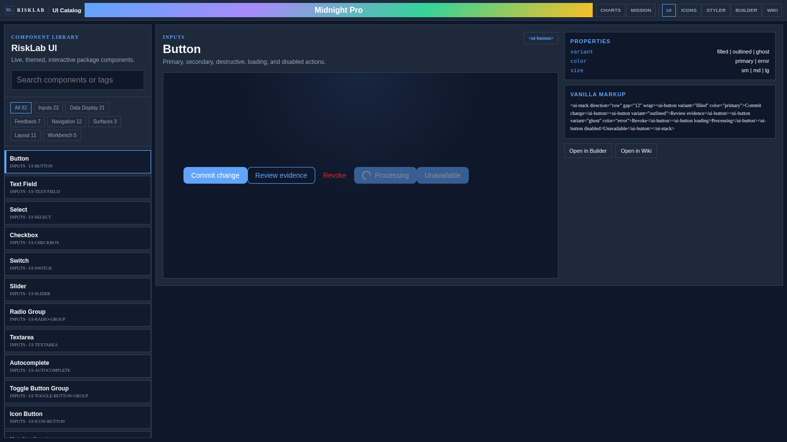

# RiskLab UI

RiskLab UI is the split-repo home for RiskLab's application-shell and UI
packages. This repo owns the shared UI primitives, analytical application shells,
and the framework adapters that sit under the public demo site at
`https://rpwalsh.github.io/`.



Live demo: [rpwalsh.github.io/?view=all](https://rpwalsh.github.io/?view=all)

## Packages

- `@risklab/ui`: vanilla and Web Component UI surface
- `@risklab/ui-react`: recommended React component package
- `@risklab/ui-vue`, `@risklab/ui-svelte`, `@risklab/ui-angular`,
  `@risklab/ui-lit`, `@risklab/ui-solid`: framework-specific adapters

## Install

| Use case | Install |
| --- | --- |
| React analytical UI | `npm install @risklab/ui-react` |
| React UI | `npm install @risklab/ui-react` |
| Vanilla or Web Components | `npm install @risklab/ui` |
| Other frameworks | install the matching `@risklab/ui-*` package |

## Quick links

- Live demos: `https://rpwalsh.github.io/`
- Getting started: [docs/getting-started.md](docs/getting-started.md)
- Design-system guidance: [docs/design-system-integration.md](docs/design-system-integration.md)
- Security reporting: [SECURITY.md](SECURITY.md)
- Contribution guide: [CONTRIBUTING.md](CONTRIBUTING.md)

## Local development

Requirements:

- Node.js `>=20`
- npm `>=10`

Core validation:

```bash
npm install
npm run lint
npm run typecheck:all
npm run test:all
npm run build:all
npm run release:check
```

## License

Apache-2.0

Redistributions must preserve the applicable copyright, license, and notice
attributions in `LICENSE` and `NOTICE`.
